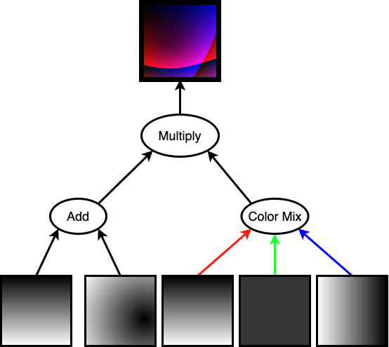

# RandomArt

This is a C++ implementation of the [Perrig & Song (1999)](https://people.eecs.berkeley.edu/~dawnsong/papers/randomart.pdf) RandomArt hash visualizer. It is based on and very similar in structure to the [random-art.org Python implementation](http://www.random-art.org/about/), but much faster.
All of the following images were generated by this program. I'm using one of them for my profile picture.


## Building

Running `make` should compile the program, yielding the executable `./run`. The program has no external dependencies.

## Usage

```
./run "some text"
```

This will generate a random image, using the hash of some text you provide as a seed. This is deterministic; the image is always the same for a given input string.

```
./run
```

Running the program without arguments will use the hash of the current time in milliseconds as the seed.

In both cases, the image is written in Netpbm PPM format out to `random.ppm`. By default the program generates a 1000x1000 image, but this can be easily changed by editing `main.cpp`

## Functionality

The program creates a tree of image operations with a specified depth. The default depth is 5. Increasing the depth increases both runtime and level of detail. This is an example tree:



The actual trees generated by the program are much larger. The operations are generated using a [Mersenne Twister](https://en.wikipedia.org/wiki/Mersenne_Twister) PRNG, seeded with the hash of whatever input string you give the program. Note that this program just uses the `std::unordered_map` hasher, which is *not* cryptographically secure. 

## See also
- [Perrig & Song original paper](https://people.eecs.berkeley.edu/~dawnsong/papers/randomart.pdf)
- Andrej Bauer's [random-art.org](http://random-art.org)
- [Loss et al. analysis of the OpenSSH VisualHostKey visualizer](http://www.dirk-loss.de/sshvis/drunken_bishop.pdf)
- [Volodymyr Shymanskyy's WebGL randomart generator](https://github.com/vshymanskyy/randomart)
